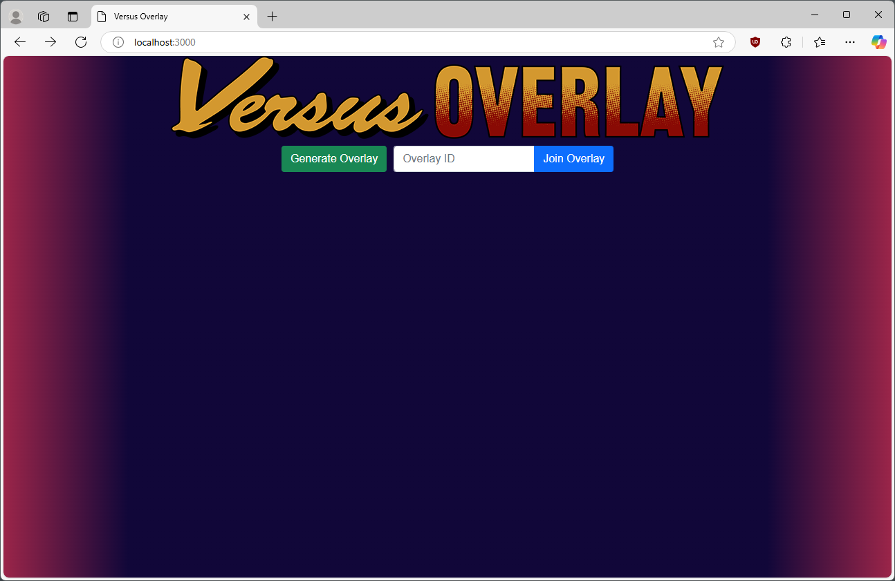
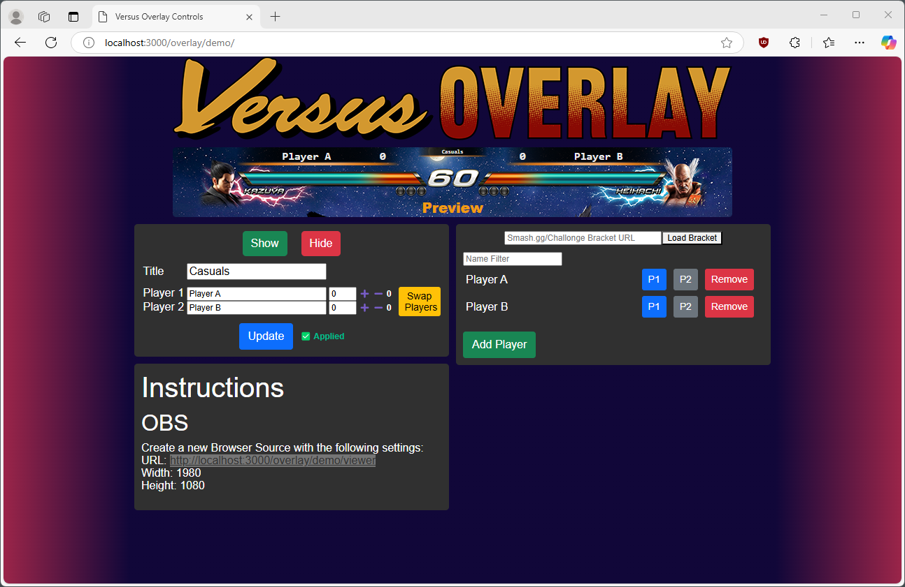
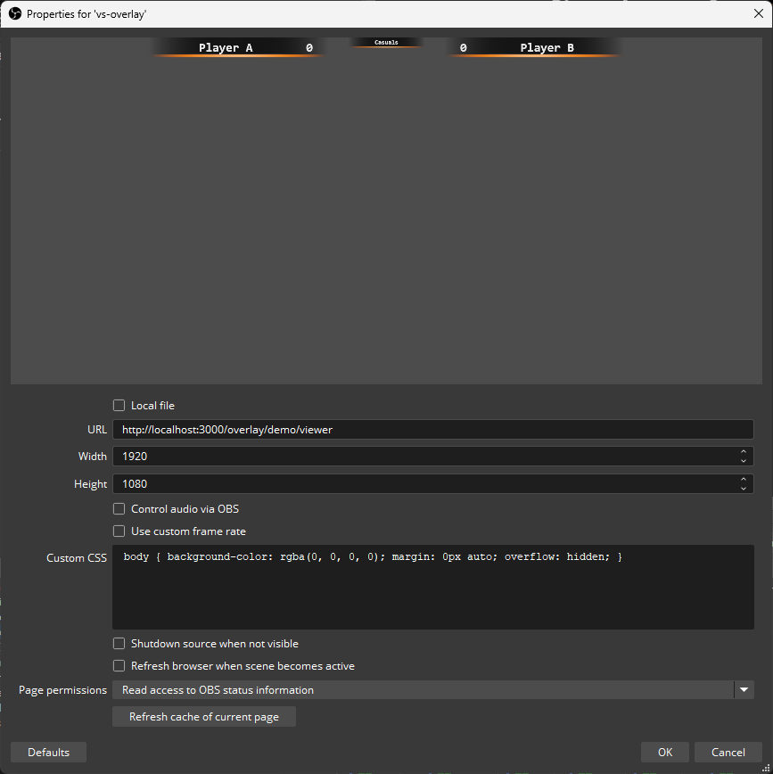

# vs-overlay

## Overview

`vs-overlay` is a web service that helps manage OBS overlays for displaying player names and score counts specifically for fighting games.

Features:
* Web based controls for updating player names and score counts.
* Player names can be saved in a list and assigned to player 1 and player 2 locations for quick updating.
* Player names can be imported from start.gg or challonge brackets.

Feature demonstration:

[](https://youtu.be/EYz7Jusi9DM?si=VVN4GY999nmSvCFc)

Hosted version: https://overlay.blastcity.net

## Usage

### Requirements

You must have nodejs installed in the environment that is running `vs-overlay`. This project has been tested to work in version `v15.3.0` but other versions should also work.

### Running the server

1. Install all dependencies by running `npm install`

1. (Optional) Set Challonge and Start.gg API access environment variables
    * `STARTGG_API_KEY` - [start.gg personal access token](https://developer.start.gg/docs/authentication/#:~:text=Generating%20a%20Token,AND%20fill%20out%20this%20form.)
    * `CHALLONGE_USERNAME` - challonge username
    * `CHALLONGE_API_KEY` - [challonge API v1 key](https://challonge.com/settings/developer)

1. Run the server using `node index.js`. The server should be running on port `3000`. You can access it at http://localhost:3000

#### Running in Docker

You can also build a docker image to run the webserver or use a pre-built container available in the [packages page](https://github.com/rsyabuta/vs-overlay/pkgs/container/vs-overlay)

### Adding to OBS

1. Access the vs-overlay webapp and enter an overlay id or generate a random one.


1. Copy the URL in the Instructions box.


1. Add a new OBS browser source with the following settings:
    * URL - the value you copied in step 2
    * Width - 1920
    * Height - 1080


1. Transform the newly created browser source to fit the screen typically with `ctrl+f`

### Controlling the overlay

You can modify player names, scores, and titles with changes applied when the Update button is pressed. Long player names (>16 characters) will have the font scaled down to fit in their respective overlay box. The player list on the right side can be used to add players for convinience with autoloading supported from challonge and start.gg tournament bracket URLs.

Example bracket URLs:
* start.gg - https://www.start.gg/tournament/frosty-faustings-xvii-2025/event/super-street-fighter-ii-turbo/brackets/1761708/2730303
* challonge - https://retroworldseries.challonge.com/tay9tt5c


### Customizing Layouts

The overlay can be customized in the css file [here](public/index.css).

```css
.topOverlay {
  height: 62px;
  width: 1920px;
  position: relative;
  z-index: 1;
  top: -62px;
  left: 0;
  background-image: url(player-versus-overlay.png);
  overflow: hidden;
  transition: top 0.4s;
  transform-origin: left top;
  display: grid;
  grid-template-columns: 
    [lmargin] 238px 
    [p1Name] 442px 
    [p1Score] 80px 
    [lgap] 80px 
    [title] 240px 
    [rgap] 80px 
    [p2Score] 80px 
    [p2Name] 442px 
    [rmargin] 238px;
}
```

Make the overlay image 1920x62 to avoid having to modify other logic. The grid template column size values can be changed to adjust where text elements will be displayed.